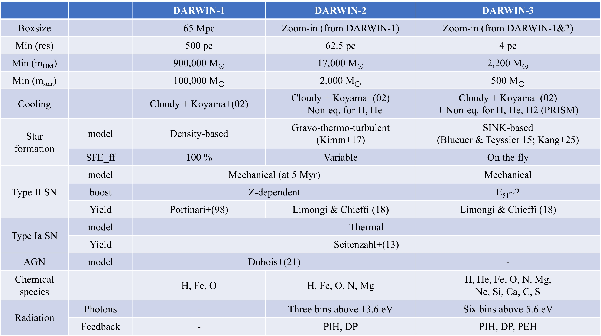

## Simulation Overview

## DARWIN-1
Please see [DARWIN-1 data structure](data_structure.html) to use the data.

### Galaxy Catalog

| Snapshot \# | Scale Factor | Redshift | Lookback Time [Gyr] | Galaxy Catalog |
|---|---|---|---|---|
|16	|0.081870	|11.214418	|13.392749 | |
|27	|0.106145	|8.421075	|13.200677 | | 
|35	|0.128217	|6.799279	|13.005799 | |
|42	|0.151253	|5.611431	|12.783937 | |
|47	|0.170207	|4.875216	|12.588438 | |
|51	|0.187066	|4.345704	|12.405398 | |
|54	|0.200343	|3.991432	|12.255546 | |
|55	|0.204674	|3.885824	|12.205619 | |
|59	|0.221619	|3.512253	|12.005520 | |
|69	|0.237951	|3.202547	|11.805793 | |
|85	|0.253797	|2.940164	|11.605918 | |
|100	|0.269203	|2.714672	|11.406138 | |
|115	|0.284229	|2.518287	|11.206374 | |
|128	|0.298925	|2.345323	|11.006588 | |
|148	|0.313345	|2.191366	|10.806496 | |
|169	|0.327477	|2.053649	|10.606767 | |
|187	|0.341391	|1.929194	|10.406759 | |
|203	|0.355055	|1.816464	|10.207304 | |
|220	|0.368577	|1.713138	|10.007117 | |
|236	|0.381901	|1.618482	|9.807340 | |
|252	|0.395073	|1.531176	|9.607452 | |
|270	|0.408114	|1.450296	|9.407464 | |
|292	|0.420985	|1.375382	|9.208168 | |
|312	|0.433782	|1.305307	|9.008236 | |
|341	|0.446475	|1.239769	|8.808291 | |
|374	|0.459079	|1.178274	|8.608340 | |
|406	|0.471563	|1.120606	|8.408982 | |
|437	|0.484009	|1.066077	|8.209053 | |
|468	|0.49641757	|1.01443311	|8.00867522 | |
|497	|0.50876024	|0.96556242	|7.80851507 | |
|527	|0.52101787	|0.91931996	|7.60884196 | |
|560	|0.53324789	|0.87530044	|7.40901196 | |
|594	|0.54544457	|0.83336685	|7.20905695 | |
|622	|0.55759286	|0.79342324	|7.00941699 | |
|642	|0.5696954	|0.755324	|6.81014782 | |

To be announced later

## DARWIN-2
Please see [DARWIN-2 data structure](data_structure.html) to use the data.

### 

## DARWIN-3

[Go to the Home Page]({{ '/' | absolute_url }})
