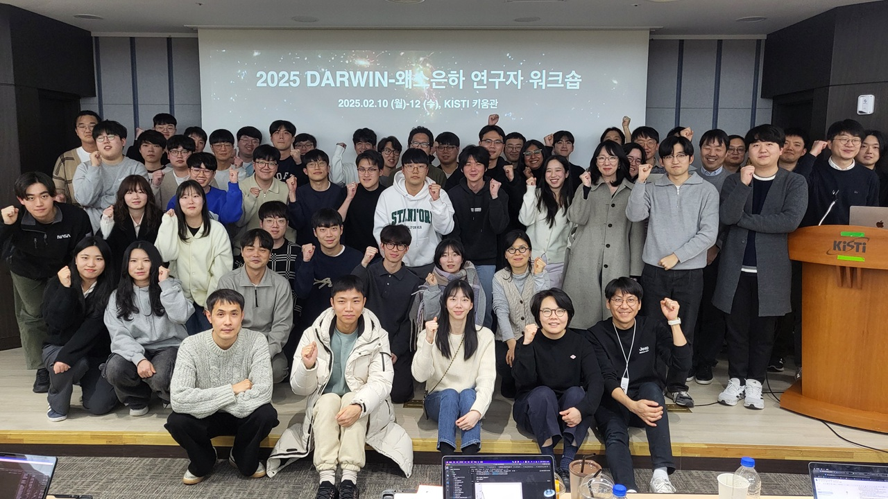
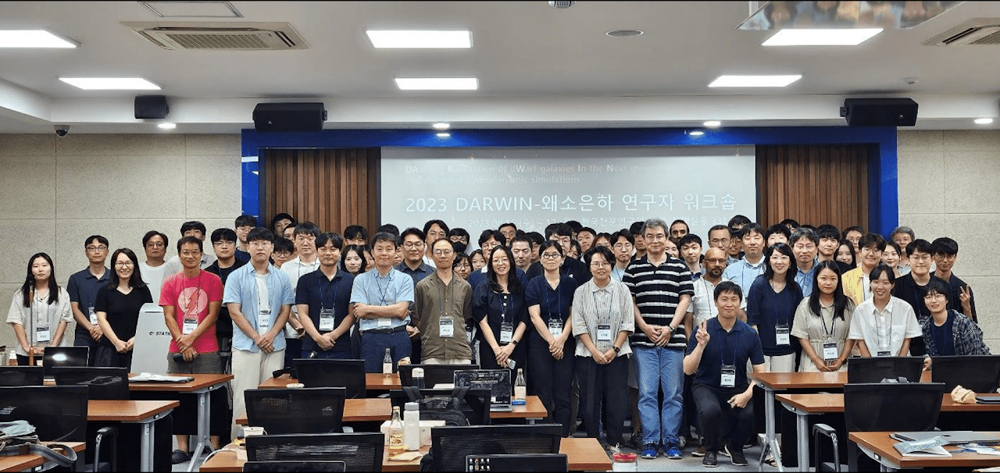

## 2025
- February 10th-12th, [2025 DARWIN-Dwarf Galaxy Researchers' Workshop](https://sites.google.com/view/2025darwin/), Korea Institute of Science and Technology Information, Daejeon

## 2024
- May 7th-10th, [The 2nd CTP Bosan Workshop: AGORA in Asia + 5th Numerical Galaxy Formation Meeting in Korea](https://ngfagora.github.io/), Seoul National University, Seoul

## 2023
<!-- - August 22nd, Special Session: Solving the Climate & Astronomy Problems with Supercomputers at [2023 Korea Supercomputing Conference](https://www.ksc.re.kr/notice/event/ksc2023#menu409), The-K Hotel, Seoul -->
- August 16th-17th, [2023 DARWIN-Dwarf Galaxy Researchers' Workshop](https://sites.google.com/view/2023darwin), Korea Astronomy and Space Science Institute, Daejeon

[Go to the Home Page]({{ '/' | absolute_url }})
